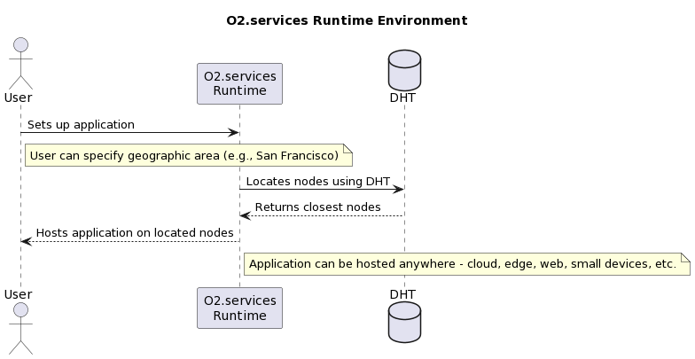

# O2.services

## Introduction

`O2.services` is an innovative platform designed for developers. Leveraging the extreme portability of WebAssembly, it enables the creation of secure, portable, and reusable components, known as actors. It simplifies the tasks of deploying, maintaining, observing, and upgrading software while minimizing the necessity of boilerplate code.

## Core Principles

`O2.services` was built upon these five key principles:

- Productivity: Enhancing the efficiency of developers and operations.
- Security: Providing enterprise-grade security.
- Cost-efficiency: Reducing costs for both development and maintenance.
- Portability: Ensuring the software can run anywhere.
- Performance: Maintaining high performance at any scale.

## Distributed, Edge, and Fog Computing

`O2.services` offers a runtime environment that can host applications virtually anywhere - from the cloud to the edge, on the web, on small devices, and beyond. This distributed computing capacity is further enhanced by the use of a decentralized hash table (DHT) to locate the closest nodes. Users can even specify a particular geographic area for node use. For example, a user could set up the application to only use nodes located in San Francisco (or any other location).

This flexibility of deployment location embraces the principles of edge computing, where data processing and analysis are performed closer to the data's origin. This approach reduces the need to transmit all data to a remote cloud system, an advantage especially notable in automated vehicles, mobile devices, and smart home appliances.

The term "edge" refers to the geographic distribution of network resources, indicating data processing near the network's edge. This proximity to the data source minimizes strain on networks and communication resources, reducing data transfer time between the cloud and IoT devices and mitigating bandwidth and latency issues.

Fog computing, a complementary concept, acts as the intermediary network links between edge devices and the cloud. It extends the cloud closer to the network's edge, enabling specific computing services to be performed on a local network, enterprise network, network router, or network hub. As a result, moving closer to the network edge can enhance network performance, improve service reliability, and reduce data computation costs.

## RPC Framework

`O2.services` uses wasmbus-rpc for intercommunication between the host runtime, actors, and providers. This framework enables seamless communication between different parts of the system.

## Declarative Deployments

`O2.services` uses the Open Application Model to define and deploy application specifications. This approach provides a declarative way to manage applications across different platforms.

## Host Runtimes

- Primary: The main host runtime for `O2.services` is the Elixir/OTP runtime.
- Experimental: An experimental JavaScript runtime is available for running an `O2.services` host in a browser or embedding in a JavaScript.

## System Characteristics

- **Hardware Compatibility:** `O2.services` can run on a wide range of devices, from desktops and laptops to tablets, phones, smart appliances, and more.
- **Scalability:** The scalability of `O2.services` is determined by the number of available devices at a given moment.
- **Reliability:** Thanks to its distributed nature, `O2.services` can withstand local outages.
- **Storage Solution:** `O2.services` offers a decentralized, sharded storage solution, secured with blockchain technology.
- **Supported Platforms:** `O2.services` can operate on any platform capable of running WebAssembly code.
- **Costs:** The costs associated with `O2.services` mainly include tech support.

## Conclusion

`O2.services` presents a new paradigm in software development, enabling the creation of highly portable and scalable applications that can run on a wide variety of platforms. Its design principles and architecture make it a robust solution for modern distributed computing needs.

[Presentation](https://docs.google.com/presentation/d/13AF-Tdij6v04uhQBPpdRNSfho5ynyMCxpT5iG3pyu-Y/edit#slide=id.g24481dc1e65_0_95)
